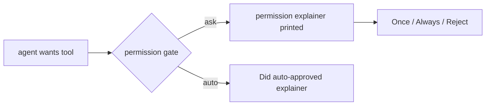

# permission-explainer

One skill. Run it, copy the rule it gives you, paste into your tool's global rules. Done.

Every time permission is asked, a permission explainer is printed before you decide — what it will do, why now, why it needs OK — so anyone can pick Once / Always / Reject.

> Explained does not mean safe: the text is written by the same agent
> asking for permission. When in doubt, Reject. Pair with least-privilege
> settings (auto-deny `sudo`/`rm -rf`) where your tool supports them.

## Mental model



Ask-path prints before you decide; auto-path prints past-tense after.

## Use

1. Ask your agent to **run the `permission-explainer` skill**.
   (Slash name varies by harness and version — `/permission-explainer`
   works where skills map to slash commands; otherwise the sentence
   above works everywhere: Bob, Claude Code, Codex, Antigravity,
   Cursor, opencode, Gemini CLI.)
2. It detects your harness and prints:
   - a copy-block rule, and
   - your exact global rules path.
3. Paste the block there. Open a new session, trigger a permission prompt, and check the permission explainer is printed before you decide.

Say `expert: minimal` any time for the 1-line form, `expert: full` for
the full form.

## Global paths

See `skills/permission-explainer/references.md` (verified 2026-09-14,
with sources). Includes opencode (`~/.config/opencode/AGENTS.md`).

Known conflict: Antigravity and Gemini CLI share `~/.gemini/GEMINI.md`.
The references file documents the `AGENTS.md` split workaround.

## Troubleshooting

- Nothing shows up: new session required (Codex builds instructions once
  per run; all tools need a restart to load the pasted rule).
- Cursor: file must be `.mdc` with `alwaysApply: true` — plain `.md` in
  `.cursor/rules/` is silently ignored. Or use User Rules
  (`Customize > Rules`) with no frontmatter.
- Antigravity: rule trigger must be `Always On` (UI setting, not a
  sentence in the rule). Check both global and project rules panels.
- Claude Code: run `/memory` — if the file isn't listed, it never
  loaded (check `~/.claude/rules/` vs `~/.claude/CLAUDE.md`).
- Gemini CLI: run `/memory show` — confirm your text is in the output.
- Codex: check `echo $CODEX_HOME` (non-default home = different file),
  remove `AGENTS.override.md` if it shadows your edit, keep global
  ≤5 KiB (32 KiB chain cap).
- opencode: `~/.config/opencode/AGENTS.md` wins over
  `~/.claude/CLAUDE.md`; check you edited the former.

## Layout

```
skills/permission-explainer/
├── SKILL.md        # on-demand generator, never Always-On
├── references.md   # global paths only (verified, with sources)
└── examples.md     # rule block + safe/destructive before-after
assets/              # before/after illustrations for README
```

English only. MIT.
