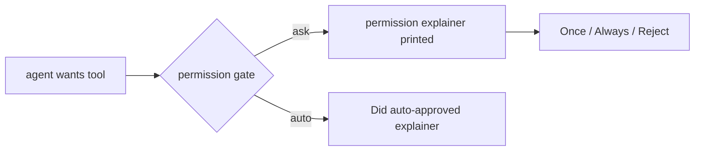
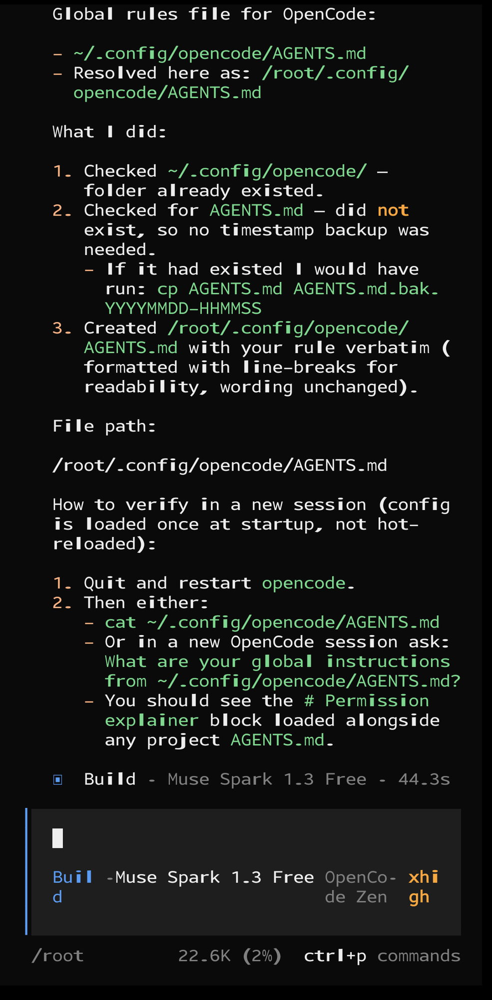
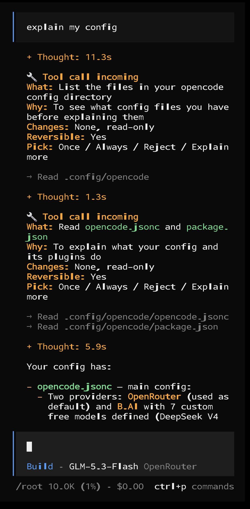
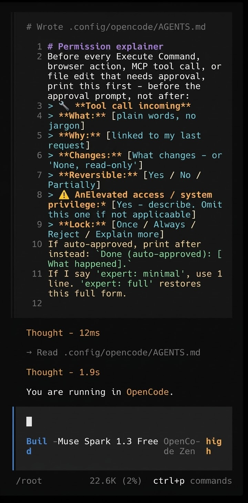

# permission-explainer

Permission prompts need technical knowledge. This skill turns them into plain words, so anyone can decide.

AI tools ask permissions — understanding them needs technical knowledge. With this skill, anyone can make an informed decision: approve or reject.

Works with Claude Code, Codex, Cursor, Antigravity, opencode, Gemini CLI, Bob.

## Install

```bash
# GitHub CLI (needs v2.90.0+): installs to the right folder for your host
gh skill install uiyuvi/permission-explainer permission-explainer

# skills.sh (Vercel): pick your agent
npx skills add uiyuvi/permission-explainer --skill permission-explainer --agent opencode
```

Manual install — copy the `skills/permission-explainer/` folder to your
host's global skills directory:

| Host | Global skills directory |
|---|---|
| opencode | `~/.config/opencode/skills/` |
| Claude Code | `~/.claude/skills/` |
| Codex | `~/.codex/skills/` |
| Gemini CLI | `~/.gemini/skills/` |

Then invoke `/permission-explainer` (or ask your agent to run the
`permission-explainer` skill). No account, no build, no dependencies.

## How it works

1. Run the skill — or paste one prompt in any tool (below).
2. The skill figures out which tool you are in and tells you where your global rules live.
3. It prints 3 things:
   - A. The rule text. You copy it.
   - B. 2 lines: what this rule does.
   - C. Where to paste it. Exact folder for your tool.
4. You paste the rule in global rules. Done.
5. Next time permission is asked, the permission explainer is printed first.
   You pick Once / Always / Reject.

> Explained does not mean safe: the text is written by the same agent
> asking for permission. When in doubt, Reject. Pair with least-privilege
> settings (auto-deny `sudo`/`rm -rf`) where your tool supports them.

## Mental model

```text
agent wants tool
  -> permission gate (ask OR auto-approved)
  -> permission explainer printed
  -> you pick: Once / Always / Reject
  -> if auto: shows as Did (auto-approved): what happened
```



Ask-path prints before you decide; auto-path prints past-tense after.

## Prompt (one paste works everywhere)

> Figure out which AI tool I am running in right now — Claude Code, Codex, Cursor, Antigravity, opencode, Gemini CLI, or Bob — tell me which one you are and where your global rules file lives. Then open that file (if the folder is missing, create it; if the file already exists, back it up first with a timestamp so nothing is lost) and add the permission explainer rule. After pasting, show me the file path and how to verify in a new session.

The skill ships this exact prompt — `/permission-explainer` runs it for you.

## Use

1. Ask your agent to **run the `permission-explainer` skill** — or paste the prompt above.
   (Slash name varies by harness and version — `/permission-explainer`
   works where skills map to slash commands; otherwise the sentence
    above works everywhere: Claude Code, Codex, Cursor, Antigravity,
    opencode, Gemini CLI, Bob.)
2. It detects your harness and prints:
   - a copy-block rule, and
   - your exact global rules path.
3. Paste the block there. Open a new session, trigger a permission prompt, and check the permission explainer is printed before you decide.

Say `expert: minimal` any time for the 1-line form, `expert: full` for
the full form, `expert: strict` for a 1-line note before every tool call
including reads.

## How it looks (real run in opencode on Termux)

**1. Install — the skill finds its own home.** The model says it is
running opencode, shows the global rules path
(`~/.config/opencode/AGENTS.md`), checks the folder, skips the backup
because the file is new, writes the rule verbatim, and prints verify
steps for a new session:



**2. Explainer in action — before the call, not after.** Asked to
"explain my config", the model prints a 🔧 **Tool call incoming** block
before each read: what it will do, why, that nothing changes
(read-only), that it is reversible, and the Once / Always / Reject /
Explain more choice:



**3. The installed rule file.** The rule as saved in the global
`AGENTS.md` — this is what makes every future session explain first.
(Wording is from the live install run; the current text in
`skills/permission-explainer/SKILL.md` is the source of truth.)



## Global paths

See `skills/permission-explainer/references.md` (verified 2026-09-14,
with sources). Includes opencode (`~/.config/opencode/AGENTS.md`).

Known conflict: Antigravity and Gemini CLI share `~/.gemini/GEMINI.md`.
The references file documents the `AGENTS.md` split workaround.

## Troubleshooting

- Nothing shows up: new session required (Codex builds instructions once
  per run; all tools need a restart to load the pasted rule).
- Cursor: file must be `.mdc` with `alwaysApply: true` — plain `.md` in
  `.cursor/rules/` is silently ignored. Or use User Rules
  (`Customize > Rules`) with no frontmatter.
- Antigravity: rule trigger must be `Always On` (UI setting, not a
  sentence in the rule). Check both global and project rules panels.
- Claude Code: run `/memory` — if the file isn't listed, it never
  loaded (check `~/.claude/rules/` vs `~/.claude/CLAUDE.md`).
- Gemini CLI: run `/memory show` — confirm your text is in the output.
- Codex: check `echo $CODEX_HOME` (non-default home = different file),
  remove `AGENTS.override.md` if it shadows your edit, keep global
  ≤5 KiB (32 KiB chain cap).
- opencode: `~/.config/opencode/AGENTS.md` wins over
  `~/.claude/CLAUDE.md`; check you edited the former.

## Layout

```
skills/permission-explainer/
├── SKILL.md        # on-demand generator, never Always-On
├── references.md   # global paths only (verified, with sources)
└── examples.md     # rule block + safe/destructive before-after
assets/              # before/after illustrations for README
```

English only. MIT.
